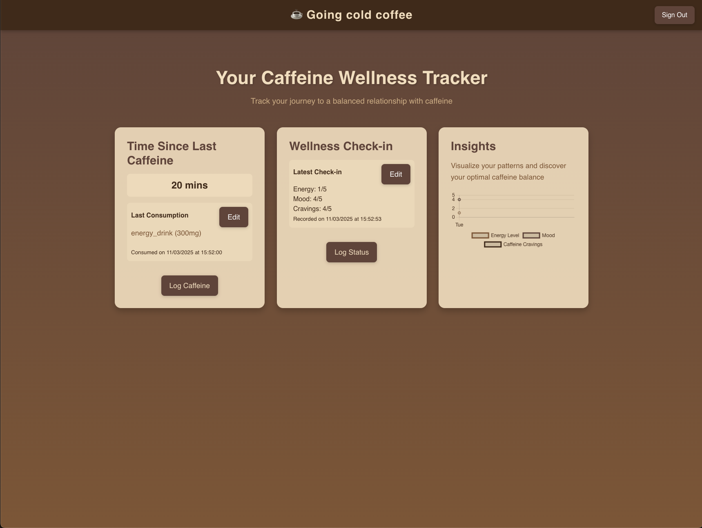

# Going Cold Coffee - Caffeine Tracking Application

## Project Overview
Going Cold Coffee is a web application designed to help users track their caffeine consumption and monitor how it affects their overall wellness. The application provides a user-friendly interface for logging caffeine intake, recording wellness metrics, and visualizing the relationship between caffeine consumption and wellbeing over time.



## Features

### User Authentication
- Secure user registration and login using Supabase authentication
- Email/password authentication
- Session management and persistence

### Caffeine Tracking
- Log caffeine consumption with details including:
  - Beverage type (coffee, espresso, tea, energy drink, soda, etc.)
  - Caffeine amount in milligrams
  - Consumption time and date
- View history of caffeine consumption
- Calculate and display time elapsed since last caffeine intake
- Edit and delete past entries

### Wellness Check-ins
- Record daily wellness metrics:
  - Energy level (1-5 scale)
  - Mood (1-5 scale)
  - Caffeine cravings (1-5 scale)
  - Optional notes
- Track patterns in wellness metrics over time

### Data Visualization
- Interactive charts showing the relationship between:
  - Caffeine consumption
  - Energy levels
  - Mood
  - Cravings
- Visualize trends over time to identify patterns

### User Interface
- Clean, responsive design
- Intuitive form controls
- Real-time feedback through toast notifications
- Interactive visual elements

## Technologies Used

- **Frontend**: HTML5, CSS3, Vanilla JavaScript
- **Authentication & Database**: Supabase
- **Visualization**: Chart.js
- **Server**: Node.js with Express


## Setup Instructions

1. Clone the repository:
   ```
   git clone https://github.com/Josh-WrightADA/apa1-supa-task-frontend.git
   cd apa1-supa-task-frontend
   ```

2. Install dependencies:
   ```
   npm install
   ```

3. Create a `.env` file in the project root with the following variables:
   ```
   SUPABASE_URL=your_supabase_url
   SUPABASE_ANON_KEY=your_supabase_anon_key
   PORT=3000
   ```

4. Start the application:
   ```
   node server.js
   ```

5. Open your browser and navigate to `http://localhost:3000`

## Project Structure

```
public/
├── js/
│   ├── caffeine.js     # Caffeine tracking functionality
│   ├── chart.js        # Chart initialization and management
│   ├── client.js       # Supabase client setup and auth
│   └── wellness.js     # Wellness tracking functionality
├── styles/
│   ├── components/
│   │   ├── buttons.css  # Button styling
│   │   ├── cards.css    # Card component styling
│   │   ├── charts.css   # Chart visualizations styling
│   │   ├── forms.css    # Form elements styling
│   │   ├── modals.css   # Modal dialog styling
│   │   ├── navbar.css   # Navigation bar styling
│   │   └── toasts.css   # Toast notifications styling
│   ├── base/
│   │   ├── base.css     # Base styling and resets
│   │   ├── layout.css   # Layout structures
│   │   └── utilities.css # Utility classes
│   └── main.css         # Main CSS file importing all modules
├── index.html          # Main application page
└── navbar.html         # Navigation component
server.js               # Express server for static files and API proxying
```


## Future Enhancements

- Advanced filtering and sorting of caffeine entries
- Expanded wellness metrics tracking
- Personalized insights and recommendations
- Mobile application version
- Account management

## Testing

The application has been tested for:
- User authentication flows
- Data persistence and retrieval
- Form validation
- Responsive design across different devices
- Error handling

[Link to testing documentation](TESTING.md)

## Demo Video

[Watch demonstration video](https://youtu.be/your_demo_video_link)

```
